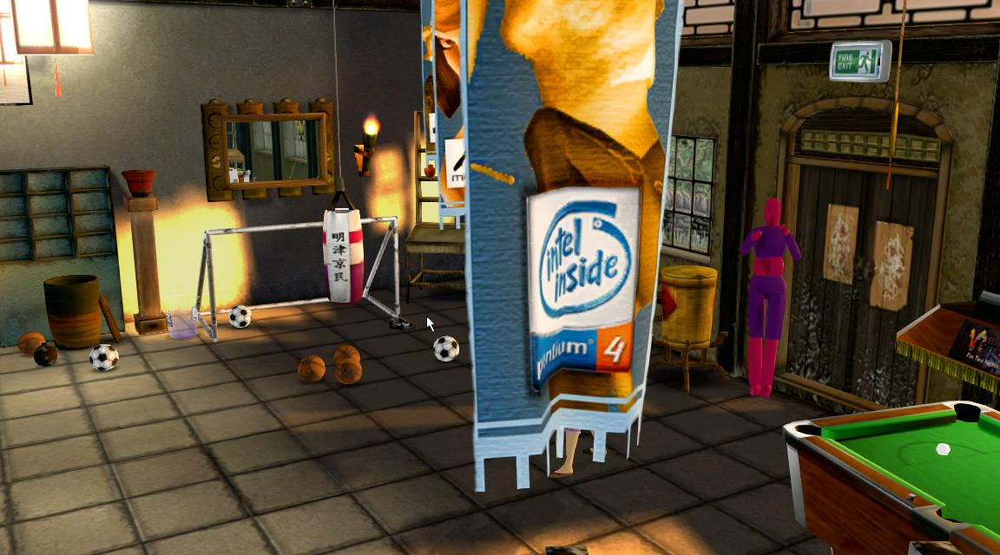
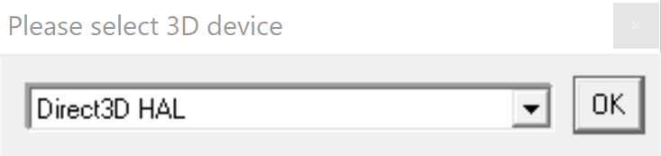

# Actor Technology Demo

## Introduction
These technology demos were released in 2000 to showcase the MathEngine physics engine and Intel Pentium 4 processor.

There are two versions:

The **Original** version was released in early 2000 to showcase MathEngine, showing off the core features of the physics engine.

The **Intel** demo was released in late 2000 to showcase the Intel Pentium 4 processor and showed some more advanced features of MathEngine including ragdolls, cloth and water boyancy. This version also used a custom version of MathEngine that was optimised with SSE2 instructions for improved performance.

For the full story of the development of these demos you can read about them in Mev's autobiography - Life Is A Game. 

<https://mevdinc.com/>

## Running the Demo

This repo contains pre-build exe's for Windows only. Other platforms are not supported and I no longer have access to the source to rebuild them. Since it was written at a time when processors ran in MHz rather than Ghz and GPUs had MBs of memory rather than GBs, it will likely run on pretty much any PC or laptop these days.

Start either demo by running the **Actor.exe** in the **Bin** folder.

You'll first see a dialog allowing a GPU device to be selected (default is likely to be fine). Click OK to start the demo which should run fullscreen.

## Usage Instructions (Intel Version)

 Keys...

	Press F1 for interactive help.

	TAB             Toggle frame rate display
	
	ENTER           Reset whole scene
	CTRL + M        Reset mirror
	CTRL + D        Reset dummy

	Space           Throw object/Hit pool ball
	Shift + LMB     Fly towards pointer
	Shift + RMB     Fly away from pointer
	V               Toggle pointer follow on/off

	B               Throw bomb
	G               Toggle gravity on/off
	F               Follow rat on/off
	Arrow keys      Rotate dragged object
	Hold CTRL       Pick pool balls
	Escape          Quit demo
	CTRL + I        Re-trigger intro sequence

	CTRL + S        Save the current state of the scene
	CTRL + L        Load a saved scene
	

	Drag with LMB to move objects left/right, up and down.
	Drag with LMB + RMB to move objects left/right, in and out.
	
	Whilst dragging an object...

	Arrow keys      Rotate object
	CTRL + Arrows     ..     ..

	CTRL + A        Pin the dragged object point in space (see below)

 Character Keys...

	Arrow keys      Move character
	Page Up/Down    Cycle character animations
	Space           Execute current animation

	CTRL+1          Trigger dummy sequence (preset camera)
	ALT+1           Trigger dummy sequence (current camera)

 Other controls...

	. Click and drag on pool balls to enter 'pool mode'; use space bar to hit balls.
	. Click on pool table coin slot to re-rack balls.
	. Click on switches to turn on/off pool light or video projector.
	. Pick up the rat to activate or deactivate it.

 Playing Pool...

	To play pool you need to click and drag with the left mouse button held down
	on one of the pool balls.  Keep the mouse button held down, and the camera will 
	'rotate' around	the pool ball, allowing you to aim the shot.  Again, keeping the 
	mouse button help down, you can then use the space bar to hit the ball...
	the longer you hold down the space bar, the harder the ball will be hit.  
	When you pot a ball you will be able to see it racking up inside the table, 
	through the transparent	window on the side.  If you pot the white ball, it will 
	be placed in the ball return slot the end of the table.  Clicking on the coin 
	slot will reset the balls.

 Using CTRL + A ...

	If you press CTRL + A whilst dragging an object, you will pin the dragged object
	so it floats in space, dangling from that position.  It will remain there until
	you drag it away again.  This allows objects to be used for target practise, or 
	for the character to kick and punch.  With the dummy you can do this to several
	of its parts at once...for example, if you pin up both of its feet, then it will
	hang upside down.  To release the object again, drag the pinned part (or parts)
	with the mouse.

## Bugs and Issues
Bare in mind that this demo was made 25 years ago at the time of writing this.

The demo's originally played videos via the projector in the room, but video player code was hardwired for a video codec that no longer seems to work. I've tried recoding the videos to other formats but that seems to cause futher issues, so I've just left them alone for the versions here.

MathEngine was one of the first available physics systems and the algorithms it used were not as robust or efficient as todays engines. As such you will see considerable instability when stacking objects, although ulimately I personaly think that kind of adds to the 'fun' of playing with objects in the demo.
